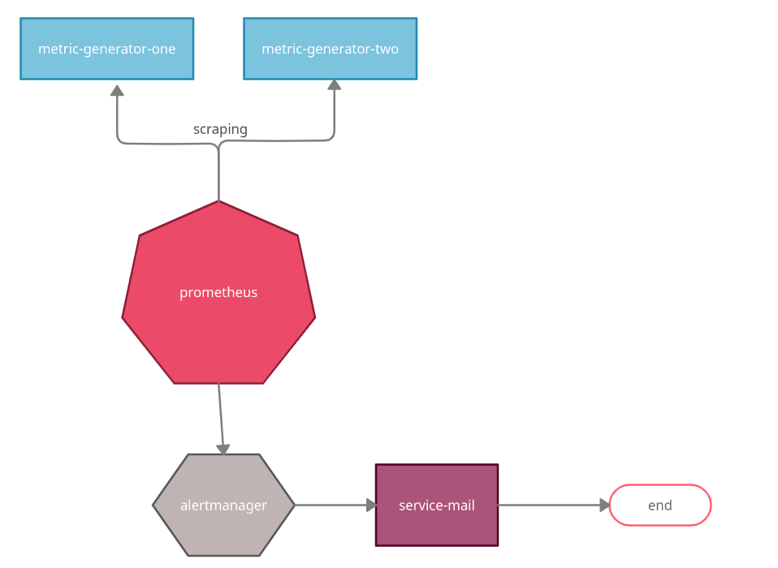
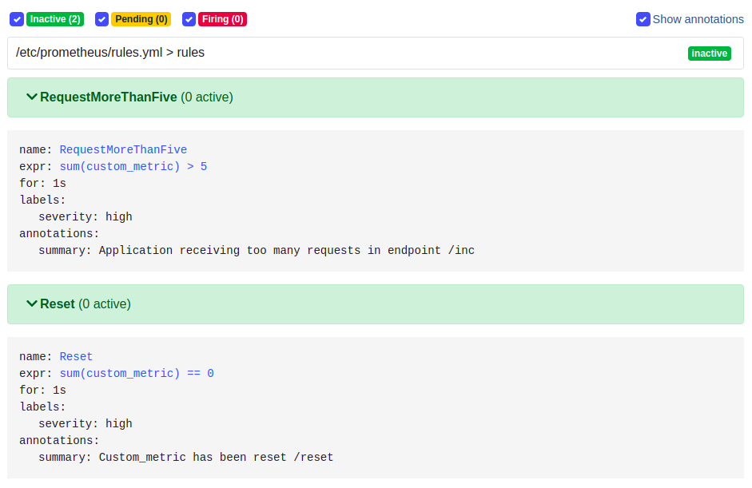
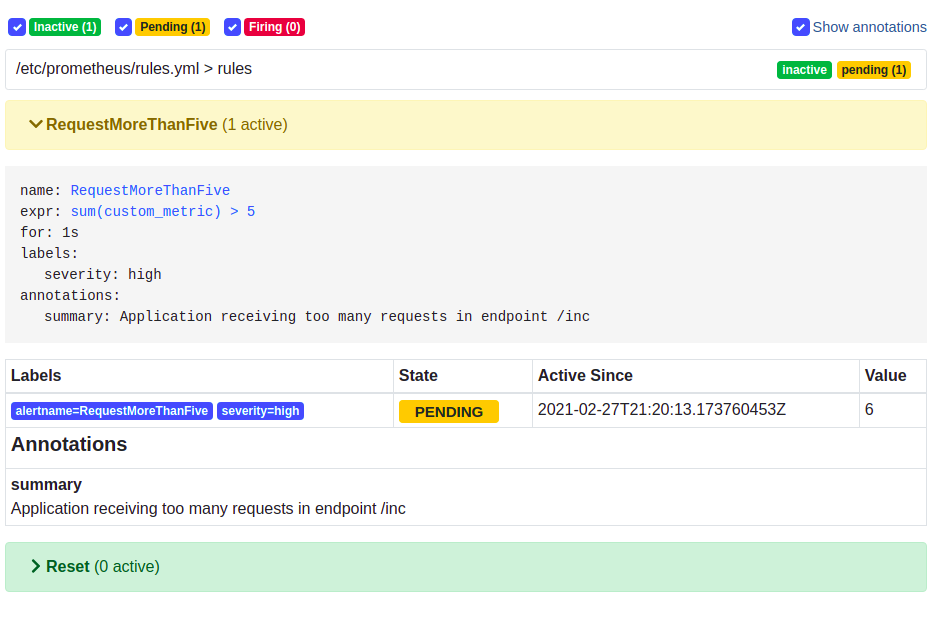
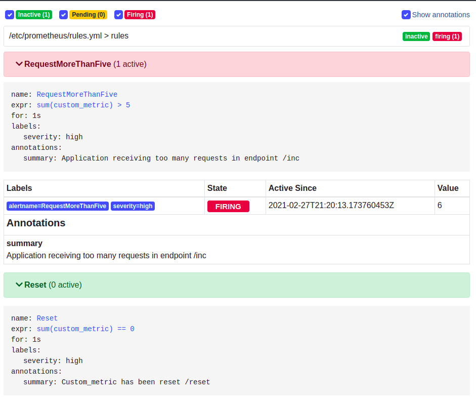
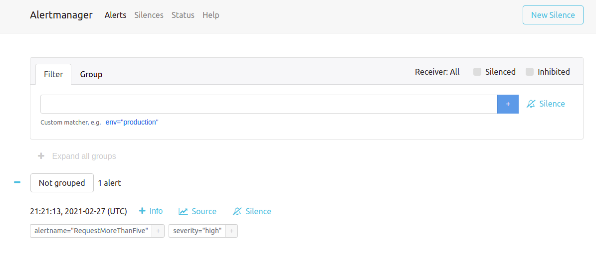
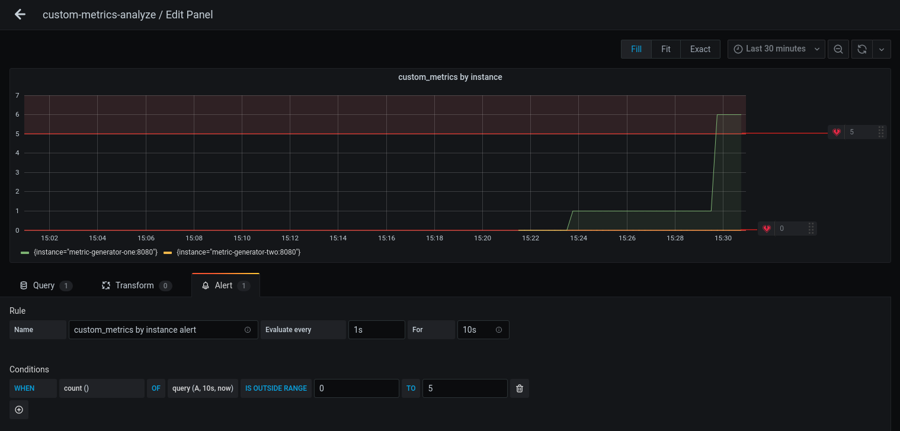

# Prometheus alert tool

## About The Project

This project was implemented example of an alert tool based of Prometheus and Alert Manager.

### Built With

* [Spring Boot](https://github.com/spring-projects/spring-boot)
   * [Spring Boot-Actuator](https://github.com/spring-projects/spring-boot/tree/master/spring-boot-project/spring-boot-actuator)
   * [micrometer](https://micrometer.io/)
* [Prometheus](https://github.com/prometheus/prometheus)
* [Alert Manager](https://github.com/prometheus/alertmanager)
* [Docker](https://docs.docker.com/engine/)
* [docker-compose](https://github.com/docker/compose)

## Getting Started
[metric-generator](metric-generator) is implemented with spring boot.
The aim of **metric-generator** is to expose three endpoints for managing (increase, reduce and reset) a custom
metric (micrometer). The custom metric is temporarily saved in a local cache.

Through Spring Boot-Actuator, **metric-generator** expose an endpoint for that Prometheus do scraping and collect the 
metrics (custom and technical metrics)

The scraping options are configured into [prometheus.yml](/prometheus.yml) concretely in first section **scrape_configs**.
```yml
scrape_configs:
  - job_name: 'metric-generator'
    scrape_interval: 2s
    metrics_path: '/actuator/prometheus'
    static_configs:
      - targets: [ 'metric-generator-one:8080','metric-generator-two:8080' ]
```

Prometheus is a collector and a time series database. Into monitoring ecosystem of Prometheus, Alert Manager is a tool 
that it allows creating the rules based in PromQL (Prometheus Query Language, language query for time series).
Depends on configuration, when the alert is fired, at the same time, is notified of different ways, for example, sending an email.

For connecting an instance of Prometheus with Alert Manager only is necessary declare into [prometheus.yml](/prometheus.yml)
```yml
alerting:
  alertmanagers:
    - static_configs:
        - targets:
            - alertmanager:9093
```

The rules of alerts are declared into [rules.yml](/rules.yml) and linked with prometheus into [prometheus.yml](/prometheus.yml):

* rules.yml 
```yml
groups:
  - name: rules
    rules:
      - alert: RequestMoreThanFive
        expr:  sum(custom_metric) > 5
        for: 1s
        labels:
          severity: high
        annotations:
          summary: Application receiving too many requests in endpoint /inc
```
* prometheus.yml 
```yml
rule_files:
  - './rules.yml'
```

To end, the environment config only need declare how alerts will be sent and for whom. 
This is done into [alertmanager.yml](/alertmanager.yml)
```yml
route:
  receiver: emailer
receivers:
  - name: emailer
    email_configs:
      - to: vklockow_n726y@hexud.com
        from: vatuhottahy-0639@yopmail.com
        require_tls: false
        smarthost: service-mail:25
```

### Prerequisites
All project is executed and orchestrated with containers and docker-compose so it's necessary has got 
install **docker** and **docker-compose**.

By default, the alerts are sent by email, hence it is needed two temporal emails, for example:
* [temp-mail](https://temp-mail.org/)
* [yopmail](http://www.yopmail.com/)

To facilitate email config into the yml file, only it is necessary executing **set-email.sh** and follow the instructions.
```sh
./set-email.sh
```
### Architecture 

### Installation

1. Clone the repo
   ```sh
      git clone https://github.com/ivanas93/prometheus-alert-tool prometheus-alert-tool
      cd prometheus-alert-tool
   ```
2. Compile [metric-generator](metric-generator)
   ```sh
   cd metric-generator
   mvn clean compile
   ```
3. Configure emails sender and receiver
   ```sh
   cd ..
   ./set-email.sh
   ```
4. Run docker-compose
   ```sh
   docker-compose up
   ```

## Usage
By default, when custom alert arrives to count equals five, the alert is fired by Prometheus. For this behaviour follows the next instructions

1. Call the endpoint **inc** until valueMetric:5
```sh
curl -v http://localhost:8080/inc
```
```json
{"valueMetric":5}
```
2. Go to [prometheus-ui-alerts](http://localhost:9090/alerts) and verify that the alert was fired after was evaluated
    2.1 Without events
    
    2.2 evaluating alert
    
    2.3 fired alert
    
3. Go to  [alert-manager-ui](http://localhost:9093/#/alerts) and verify that alert was send to receivers.

   
## Bonus 
Another way of microservice alerting is across Grafana. For this option , It's had added a new service into docker-compose. 
This service is configured to aggregate into a container a data source configuration and a pre-configured dashboard.
After use  ``` docker-compose up ``` , only it is necessary open [grafana-ui](http://localhost:3000/d/custom-metrics-analyze/custom-metrics-analyze?viewPanel=2&orgId=1).

